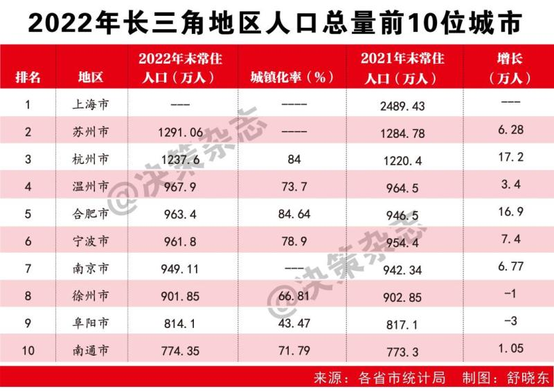

### 华东

- _上海_
- 苏州 江苏
- **杭州** 浙江
- **南京** 江苏
- 宁波 浙江
- 无锡 江苏
- 绍兴 浙江
- 温州
- 嘉兴
- 常州
- 金华
- 台州
- 南通
- **合肥**（4.88）
  

### 华北

- _北京_
- **青岛** 2023 年 9 月 24 日
- _天津_ 2023 年 9 月 24 日
- **济南**（4.88）2023 年 9 月 24 日
- 烟台 （4.5）

### 华中

- **长沙** 2023 年 9 月 24 日
- _武汉_（5.38）2023 年 9 月 24 日

### 华南

- _深圳_
- _广州_
- 厦门
- 佛山
- **东莞** （6.3W）
- 泉州
- 福州 （4.6）

### 东北

大连
**沈阳** 4.5W

### 西北

### 西南

- _成都_ 4.79 2023 年 9 月 24 日
- 昆明（4.39） 2023 年 9 月 24 日
