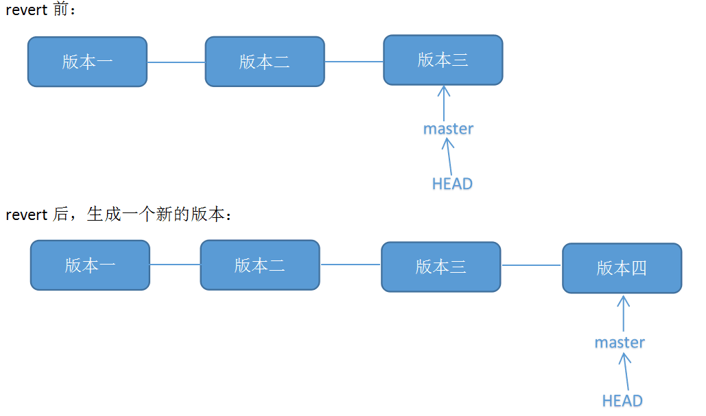

# git 远程仓库回退的两种方式

---

## 一、问题描述

在利用 github 实现多人合作程序开发的过程中，我们有时会出现错误提交的情况，此时我们希望能撤销提交操作，让程序回到提交前的样子，本文总结了两种解决方法：回退（ [reset](https://so.csdn.net/so/search?q=reset&spm=1001.2101.3001.7020) ）、反做（revert）。

---

## 二、背景知识

git 的版本管理，及 HEAD 的理解
使用 git 的每次提交，Git 都会自动把它们串成一条时间线，这条时间线就是一个分支。如果没有新建分支，那么只有一条时间线，即只有一个分支，在 Git 里，这个分支叫主分支，即 master 分支。有一个 HEAD 指针指向当前分支（只有一个分支的情况下会指向 master，而 master 是指向最新提交）。每个版本都会有自己的版本信息，如特有的版本号、版本名等。如下图，假设只有一个分支：

---

## 三、解决方法

### 方法一：git reset

原理： git reset 的作用是修改 HEAD 的位置，即将 HEAD 指向的位置改变为之前存在的某个版本，如下图所示，假设我们要回退到版本一：

适用场景：  如果想恢复到之前某个提交的版本，且那个版本之后提交的版本我们都不要了，就可以用这种方法。

具体操作：

1\. 查看版本号：
可以使用命令 `git log` 查看：

也可以在 github 网站上查看：

2\. 使用 `git reset --hard 目标版本号 ` 命令将版本回退：

`--hard` 参数:

- Resets the index and working tree. Any changes to tracked files in the working tree since commit are discarded.
- 重置索引和工作树。 自 commit 以来，工作树中跟踪文件的任何更改都将被放弃。

再用 `git log` 查看版本信息，此时本地的 HEAD 已经指向之前的版本：

3\. 使用 `git push -f` 提交更改：
此时如果用 `git push` 会报错，因为我们本地库 HEAD 指向的版本比远程库的要旧：

所以我们要用 `git push -f` 强制推上去，就可以了：

在 github 图形化界面上看，远程库的 HEAD 也已经指向目标版本：

完成

### 方法二：git revert

原理： git revert 是用于 `反做` 某一个版本，以达到撤销该版本的修改的目的。比如，我们 commit 了三个版本（版本一、版本二、 版本三），突然发现版本二不行（如：有 bug），想要撤销版本二，但又不想影响撤销版本三的提交，就可以用 git revert 命令来反做版本二，生成新的版本四，这个版本四里会保留版本三的东西，但撤销了版本二的东西。如下图所示：

适用场景：  如果我们想撤销之前的某一版本，但是又想保留该目标版本后面的版本，记录下这整个版本变动流程，就可以用这种方法。

具体操作：

举个例子，现在库里面有三个文件： [READ.md](http://read.md/) 、text.txt、text2.txt。

1\. 查看版本号：
可以通过命令行查看（输入 git log）：
如图，最近的两个版本分别叫：`add text.txt`（即新增了文件 text.txt）、`add text2.txt`（新增了文件 text2.txt）。这个时候我们不需要 text.txt 这个文件了，那就是说不想要 `add text.txt` 那个版本的操作，那可以通过反做 `add text.txt` 这个版本来实现。

也可以通过 github 网站图形化界面查看版本号：

2.使用 `git revert -n 版本号 ` 反做，并使用 `git commit -m 版本名 ` 提交：
（1）反做，使用 `git revert -n 版本号 ` 命令。如下命令，我们反做版本号为 8b89621 的版本：

git revert -n 8b89621019c9adc6fc4d242cd41daeb13aeb9861
注意：  这里可能会出现冲突，那么需要手动修改冲突的文件。而且要 git add 文件名。
（2）提交，使用 `git commit -m 版本名 `，如：

git commit -m "revert add text.txt"
此时可以用 `git log` 查看本地的版本信息，可见多生成了一个新的版本，该版本反做了 `add text.txt` 版本，但是保留了 `add text2.txt` 版本：

3.使用 `git push` 推上远程库：

git push
查看 github 上显示的远程库版本信息：

此时查看仓库的文件，剩下两个： [READ.md](http://read.md/) 、text2.txt

完成

---

原网址: [访问](https://blog.csdn.net/chushoufengli/article/details/101683839)
