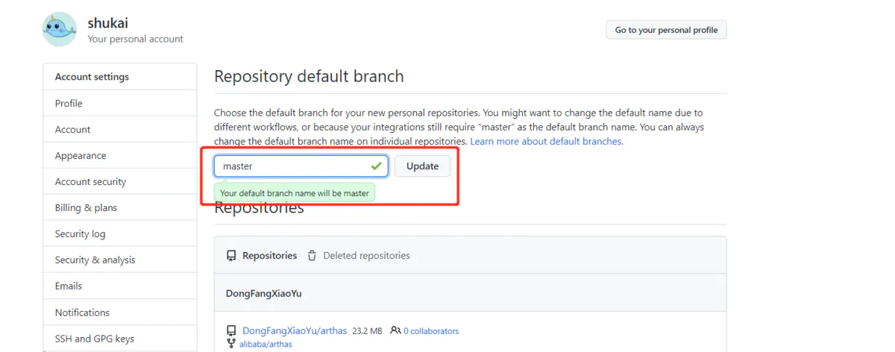
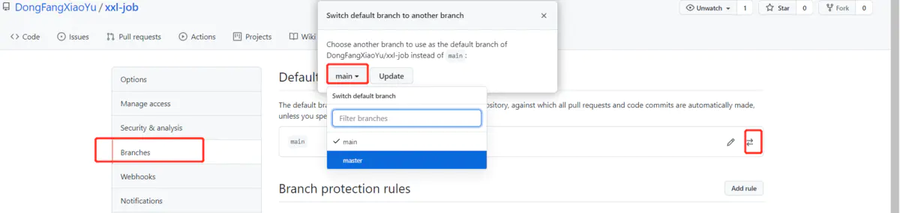

# github 将默认 main 分支改成 master

github 在 2020/10/1 宣布上的所有新库都将用中性词「main」命名，取代原来的「master」，如果我们通过 git push -u grigin master 方法上传仓库，在 github 仓库中就会出现一个 master 的分支。

#### 1.为保持一致性，可将本地 git init 的时候默认分支修改为 main：

提交代码可参考：[将代码提交到 github](https://links.jianshu.com/go?to=https%3A%2F%2Fshukai.fun%2FfindArticle%3FarticleId%3D1545709519%26originalAuthor%3D%25E8%2588%2592%25E5%2587%25AF)

```shell
#将代码上传到master分支（旧）
1.git init       //工作空间创建.git文件夹（默认隐藏了该文件夹）
2.git add .      //添加到暂存区
3.git commit -m "你的提交注释注释"
4.git remote add origin http://xxxxxxxxx.git   //本地仓库和远程github关联
5.git pull --rebase origin master  //远程有readme.md，拉一下
6.git push -u origin master        //代码合并
--------------------------------------------------------------------
#1.将代码上传到GitHub的默认main分支（新）
1.git --version    #查看版本
2.git config --global init.defaultBranch main   #git在2.28.0上，重新设置git默认分支为main

#2.在执行提交操作即可
1.git init       //工作空间创建.git文件夹（默认隐藏了该文件夹）
2.git add .      //添加到暂存区
3.git commit -m "你的提交注释注释"
4.git remote add origin http://xxxxxxxxx.git   //本地仓库和远程github关联
5.git pull --rebase origin main  //远程有readme.md，拉一下
6.git push -u origin main        //代码合并
```

如果不小心，创建了 mster 分支，强迫症，可以执行下面命令删除分支

```shell
删除本地分支：git branch -d 分支名称
强制删除本地分支：git branch -D 分支名称
删除远程分支：git push origin --delete 分支名称
```

#### 2.如果习惯了将 master 作为默认分支，也可以修改 github 仓库的配置信息：

上面的 git init 不用改，只需要中 github 的个人设置中找到>Repositories>将默认的 main，改为 master 然后再创建项目仓库即可：




image-20210812112632838

修改单个库的默认分支：

打开指定库，setting


image-20210812132952531

将默认分支改为 master 即可：



image-20210812133248620

---

原网址: [访问](https://www.jianshu.com/p/e8342a72c101)

[[git]]
