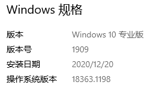
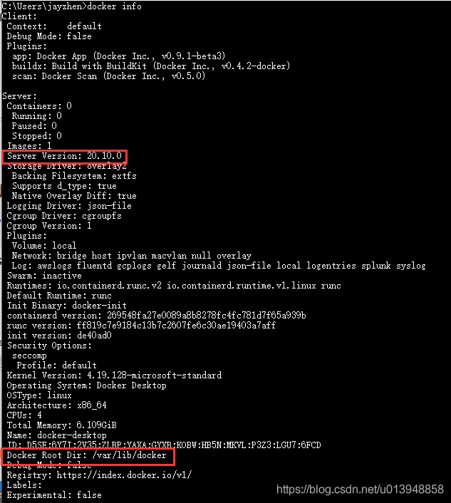
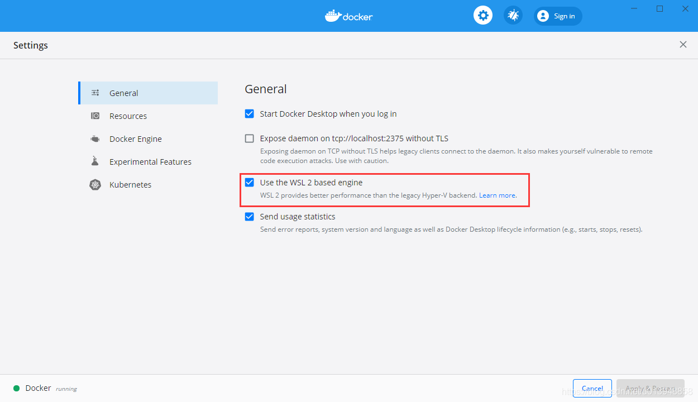
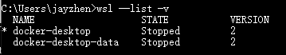
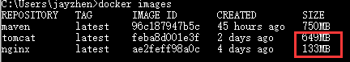

# 【Docker】win10上修改docker的镜像文件存储位置（九）- 通过WSL2修改

闲话少说  

### 文章目录

*   *   *   [1.件版本](#1_2)
        *   [2.安装过程所遇](#2_7)
        *   [3.使用WSL修改docker文件存储位置](#3WSLdocker_13)
        *   [4.如何验证有效](#4_44)
        *   [5.参考资料](#5_52)

### 1.件版本

*   window 10 v1909 小版本号  
    
*   Docker Desktop Installer v20.10.0（ 细致版本看下图）

### 2.安装过程所遇

1.  官网下载的docker.exe直接安装即可，安装中间选项，直接安装的C盘下（`C:\Program Files\Docker`），由上面的docker info可看出，docker的默认路径（`/var/lib/docker`）跟linux一样了，与window的之前docker版本不一样了，这是为什么？
2.  点击安装的docker icon,启动桌面，会提示安装[WSL](https://docs.microsoft.com/zh-cn/windows/wsl/about)（这是啥，这里就不赘述了），安装提示安装即可，版本是`WSL2`，如果不安装，启动不了`docker engine`服务，当然也可以不使用这个，如下图，设置中有选项，可尝试，让后再修改试试看，不过我建议按默认的来，官网推荐；  
    
3.  目前的docker版本依附WSL来进行文件映射，所以，我们需要通过wsl来修改docker的文件映射路径，可理解为文件挂载

### 3.使用WSL修改[docker](https://so.csdn.net/so/search?q=docker&spm=1001.2101.3001.7020)文件存储位置

WSL2模式下docker-desktop-data vm磁盘映像通常位于以下位置：  
`C:\Users\jayzhen\AppData\Local\Docker\wsl\data\ext4.vhdx`  
按照以下说明将其重新定位到其他驱动器/目录，并保留所有现有的Docker数据。

*   首先，右键单击`Docker Desktop`图标关闭Docker桌面，然后选择退出Docker桌面，然后，打开命令提示符：
    
    ```
    wsl --list -v
    ```
    
*   您应该能够看到，确保两个状态都已停止。  
    

> 默认情况下，Docker Desktop for Window会创建如下两个发行版（distro) C:\\Users\\jayzhen\\AppData\\Local\\Docker\\wsl  
> docker-desktop (对应distro/ext4.vhdx)  
> docker-desktop-data （对应data/ext4.vhdx）  
> 按官网提示：vhdx文件最大支持256G，超出大小会有异常。当然我的C盘也没那么大[官方说明](https://docs.microsoft.com/en-us/windows/wsl/compare-versions#expanding-the-size-of-your-wsl-2-virtual-hard-disk)

*   将`docker-desktop-data`导出到文件中(备份image及相关文件)，使用如下命令
    
    ```
    wsl --export docker-desktop-data "D:\\docker-desktop-data.tar"
    ```
    
*   从wsl`取消注册`docker-desktop-data，请注意`C:\Users\jayzhen\AppData\Local\Docker\wsl\data\ext4.vhdx`文件将被自动删除。
    
    ```
    wsl --unregister docker-desktop-data
    ```
    
*   将导出的`docker-desktop-data`再导入回wsl，并设置我们想要的路径，**即新的镜像及各种docker使用的文件的挂载目录**，我这里设置到`D:\\docker\\wsl`
    
    ```
    wsl --import docker-desktop-data "D:\\docker\\wsl" "D:\\docker-desktop-data.tar" --version 2
    ```
    
*   命令执行完毕，就能再目录下看到文件了，这时次`启动Docker Desktop`，可以正常工作了
    

### 4.如何验证有效

修改前记录 `C:\Users\jayzhen\AppData\Local\Docker\wsl`目录文件大小（大于2G）  
修改后，在记录其文件大小（小于200M）和`D:\\docker\\wsl`（1.47G），然后`docker pull`任意一个镜像（我下载了nginx、tomcat），再看`C:\Users\jayzhen\AppData\Local\Docker\wsl`目录无变化，而`D:\\docker\\wsl`增大到`2.26G`  


最后，如果在验证后一切没有问题，则可以删除`D:\\docker-desktop-data.tar`文件，记住可不是ext4.vhdx文件，这可是重要文件

### 5.参考资料

1.  [什么是Linux的Windows子系统？](https://docs.microsoft.com/en-us/windows/wsl/about)
2.  [扩展WSL 2虚拟硬盘的大小](https://docs.microsoft.com/en-us/windows/wsl/compare-versions#expanding-the-size-of-your-wsl-2-virtual-hard-disk)
3.  [在WSL 2上开始使用Docker远程容器](https://docs.microsoft.com/en-us/windows/wsl/tutorials/wsl-containers)
4.  [Docker桌面WSL 2后端简介](https://www.docker.com/blog/new-docker-desktop-wsl2-backend/)
5.  [移动Docker wsl文件](https://github.com/docker/for-win/issues/5829)
6.  [运行Windows和WSL时Docker卷位于何处？](https://stackoverflow.com/questions/61083772/where-are-docker-volumes-located-when-running-windows-and-wsl#answer-61147954)
7.  [在Windows 10 Home中使用WSL2时如何更改docker映像的位置？  
    ](https://stackoverflow.com/questions/62441307/how-can-i-change-the-location-of-docker-images-when-using-wsl2-with-windows-10-h)

---

原网址: [访问](https://blog.csdn.net/u013948858/article/details/111464534)