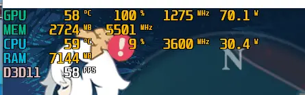
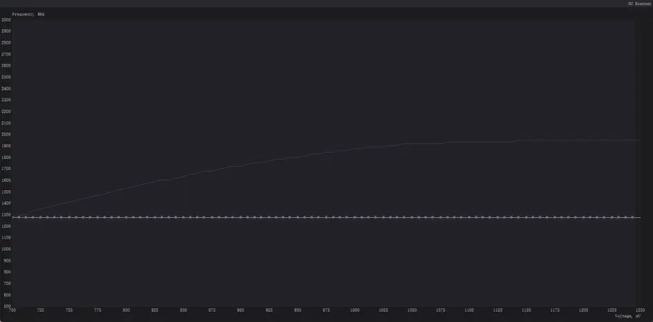

前几天收到一台炫龙 M7，配置 3600+2070。

### CPU 降压

初始电压过高，导致待机温度下不起，风扇呼呼响。

目前常见的降压方式分四种

| 方式           | 优点         | 缺点                         |
| -------------- | ------------ | ---------------------------- |
| BIOS           | 开机自动生效 | 高风险，一旦出错只能用编程器 |
| Ryzan Master   | 安全         | 需要开机后手动应用           |
| ZenStates      | 安全         | 开机自动生效                 |
| Control Center | 自带         | 经常无效                     |

#### 个人建议

BIOS 降压需要先解锁 BIOS，这个相对比较简单，但是设置电压时，特别注意，需要你填入的是十六进制的数字。

具体计算方式为 1.55-十六进制转十进制 ×0.00625。例如 3600，0.95V，则（1.55-0.95）/0.00625=96，十进制 96 转十六进制为 60，所以填入 60。

在 BIOS 中操作时，一定要特别小心，只建议填写较为稳定的频率和电压，最好是经过烤机和长时间生产条件验证的。故 BIOS 降压为最终手段。

Ryzen Master，官方工具，每次开机后都要手动应用，此为调试手段。

ZenStates，支持开机自启和自动应用，对于不想折腾 BIOS 的，此为首选。

CC，反正我自测无效。

### GPU 降温

为什么要 GPU 降压？

我不管玩什么游戏，多少占用率，这个显卡调度，都会跑到 115W，然后就开启了直升机模式。

GPU 降温，方式有两种

- MSI AfterBurner
- CC

在 CC 的省电模式中，可以自动将显卡频率降到 1260Mhz，此时电压约为 0.68V，功耗大概 70W。

这个温度不是更舒服吗？

但是，我并不推荐用 CC。CC，毫无疑问，是个 laji 软件。它的权限太高，甚至可以覆盖 BIOS 里面的电压设置（偶尔），它和 RM，ZenStates，BIOS，都不兼容。

此时，虽然显卡的功耗降下来了，CPU 还是 70+度。所以还是建议卸载 CC。

下为 AfterBurner 的电压曲线。

#### 操作方法

按下 SHIFT 选中所有点，点击最左边的点，SHIFT+两次回车，曲线就会变值。

有兴趣可以自己搜索 AfterBurner 降压超频相关教程。
